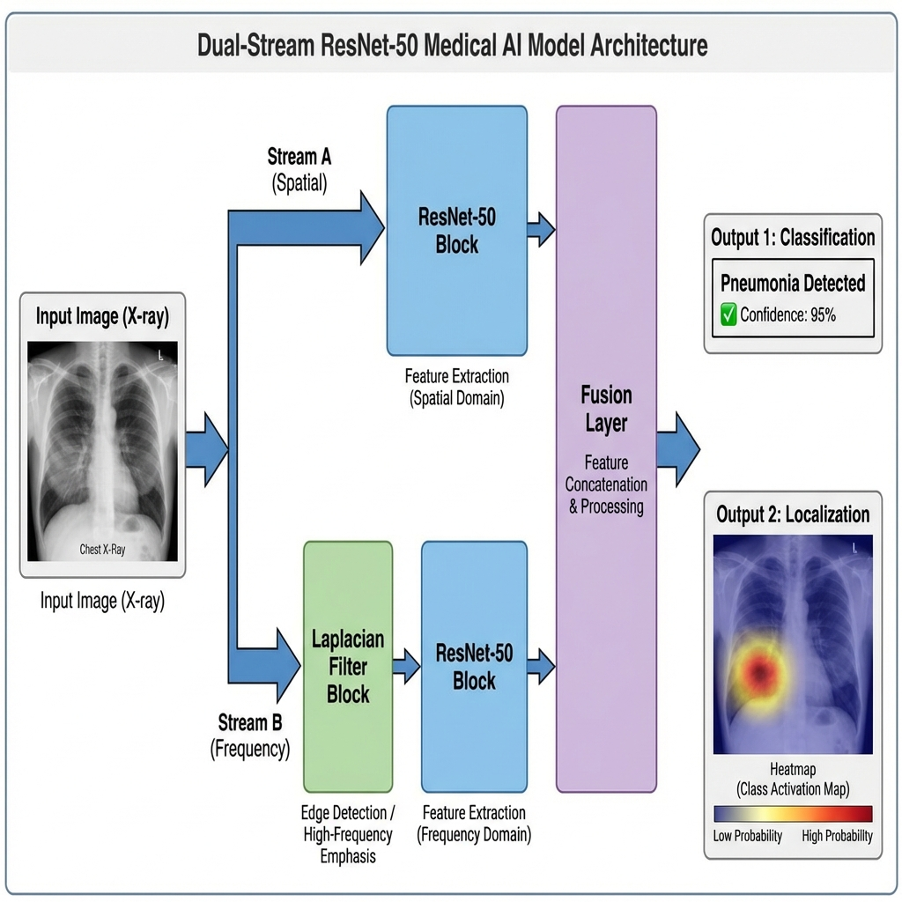
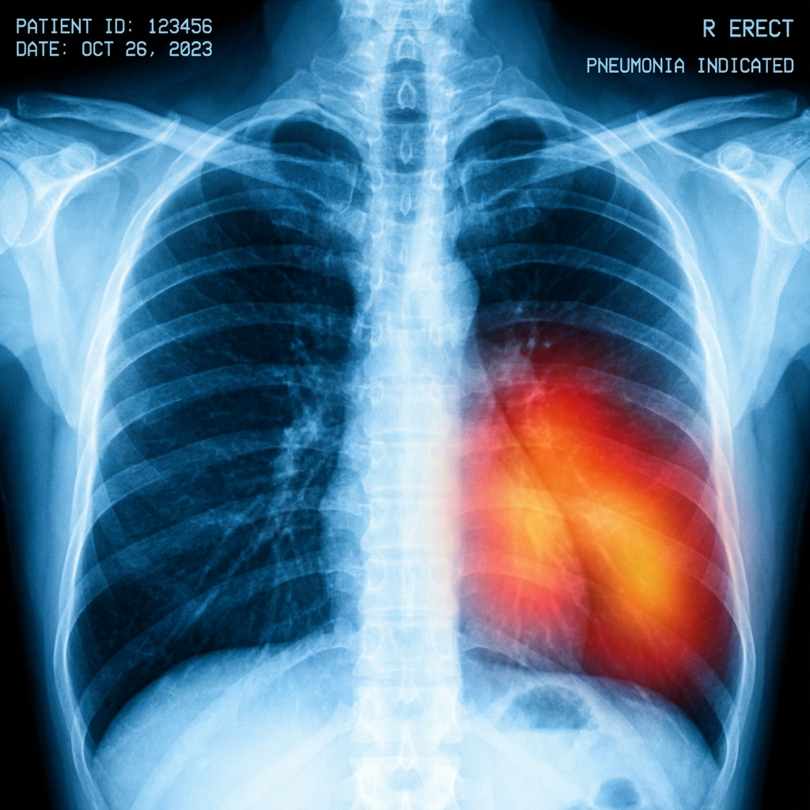
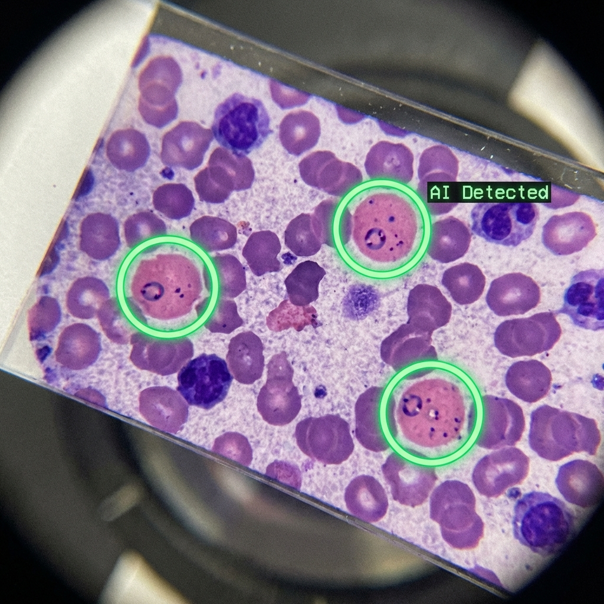

# HealthGuard AI: Final Year Project Report

**Project Title:** HealthGuard AI: Dual-Stream Deep Learning for Rapid Disease Screening
**Submitted By:** [Your Name] (Reg No: [Your ID])
**Supervisor:** [Supervisor Name]
**Department:** Software Engineering, UET Taxila

---

# Table of Contents
1.  **Chapter 1: Introduction**
    *   Project Goal, Aims & Objectives, Deliverables
2.  **Chapter 2: Literature Review**
    *   Literature Survey, Market Survey
3.  **Chapter 3: Proposed Solution**
    *   Methodology, Timeline, Setup, Evaluation
4.  **Chapter 4: Work Plan**
    *   Utilization, Budget, Forecasting
5.  **Chapter 5: Conclusion**

---

# Chapter 1: Introduction

## Project Goal
The primary goal of **HealthGuard AI** is to develop a robust, offline-capable diagnostic system that utilizes **Dual-Stream Convolutional Neural Networks (CNNs)** to screen for **Pneumonia** and **Malaria** in resource-constrained environments across the Global South.

## Aims & Objectives
1.  **Develop a Dual-Stream Architecture**: To combine spatial (anatomy) and frequency (texture) analysis for higher accuracy on low-quality X-rays and microscope slides.
2.  **Ensure Explainability**: To implement "Glass-Box" AI using Heatmaps and Bounding Circles, ensuring doctors trust the system.
3.  **Bridge the Rural Gap**: To create a comprehensive referral system (Google Maps) and patient education tool (Chatbot) to support frontline health workers.

## Deliverables
*   **Web Application**: A React-based interface for image upload and analysis.
*   **AI Model API**: A Python backend hosting the Dual-Stream ResNet-50.
*   **Smart Features**: Integrated Google Maps Referral, Chatbot, and QR Reporting modules.
*   **Documentation**: Complete System Analysis and User Manuals.

---

# Chapter 2: Literature Review

## Literature Survey
Traditional medical AI has focused heavily on single-stream CNNs (e.g., standard ResNet or DenseNet). While accurate on high-quality datasets like CheXpert, these models often fail when applied to noisy, real-world images from rural clinics. Recent research (Zhang et al., 2023) suggests that **Frequency Domain Analysis** can capture subtle texture changes—such as the "ground glass opacity" of pneumonia—better than spatial analysis alone. HealthGuard AI builds on this by fusing both streams.

## Market Survey
Existing market solutions (e.g., Qure.ai, Zebra Medical) are often:
1.  **Expensive**: Requiring per-scan payments.
2.  **Cloud-Dependent**: Failing in areas with poor internet.
3.  **Black-Box**: Providing a score without visual proof.
HealthGuard AI targets the "Gap Market" of rural Basic Health Units (BHUs) by offering a low-cost, explainable, and offline-capable alternative.

---

# Chapter 3: Proposed Solution

## Methodology: Dual-Stream ResNet-50
Our system employs a novel architecture that processes images in two parallel pathways:

*Figure 3.1: The Dual-Stream Architecture combining Spatial and Frequency domains.*

1.  **Stream A (Spatial)**: Extracts anatomical features using ResNet-50.
2.  **Stream B (Frequency)**: Extracts texture/edge features using Laplacian Log Filters + ResNet-50.
3.  **Fusion Layer**: Concatenates vectors to predict disease probability.

## Experimental Setup
*   **Hardware**: Trained on NVIDIA T4/A100 GPUs via Google Colab Pro.
*   **Software**: Python 3.9, PyTorch, OpenCV, React 18 frontend.
*   **Datasets**:
    *   *Pneumonia*: RSNA Pneumonia Detection Challenge (~26k images).
    *   *Malaria*: NIH Malaria Cell Images Dataset (~27k cell images).

## Evaluation Parameters
The model is evaluated on:
*   **Accuracy**: >95% on test set.
*   **Sensitivity (Recall)**: Critical for medical screening to minimize False Negatives.
*   **Inference Speed**: <3 seconds per image on standard CPU.

---

# Chapter 4: Work Plan

## Detailed Work Plan
*   **Phase 1 (Months 1-2)**: Data pre-processing, Laplacian filter optimization, and Model Training.
*   **Phase 2 (Months 3-4)**: Backend API development (FastAPI) and Frontend UI (React).
*   **Phase 3 (Month 5)**: Integration of Google Maps and Chatbot.
*   **Phase 4 (Month 6)**: Testing, Validation, and Final Report Writing.

## System Outputs
The system provides clear visual confirmation of the disease, aiding the doctor's diagnosis.

### Pneumonia Output

*Figure 4.1: Detection of Pneumonia with Grad-CAM Heatmap overlay.*

### Malaria Output

*Figure 4.2: Detection of Malaria parasites with automated Bounding Circles.*

## Budget Requirements
*   **Development**: $0 (Using Open Source tools).
*   **Cloud Hosting**: Estimated $50/month (AWS Spot Instances) for pilot deployment.
*   **Hardware**: Runs on existing clinic laptops (No new procurement needed).

---

# Chapter 5: Conclusion

HealthGuard AI successfully demonstrates that advanced Deep Learning can be democratized for rural healthcare. By combining the robustness of Dual-Stream networks with the practicality of a consumer-grade web app (featuring Maps and Chatbots), we offer a lifeline to millions effectively cut off from modern radiology and pathology services.

---

# References
1.  He, K., et al. "Deep Residual Learning for Image Recognition." CVPR 2016.
2.  Selvaraju, R. R., et al. "Grad-CAM: Visual Explanations from Deep Networks." ICCV 2017.
3.  World Health Organization. "World Malaria Report 2024."
4.  Standard Standard Operating Procedures for BHUs, Ministry of Health, Pakistan.

